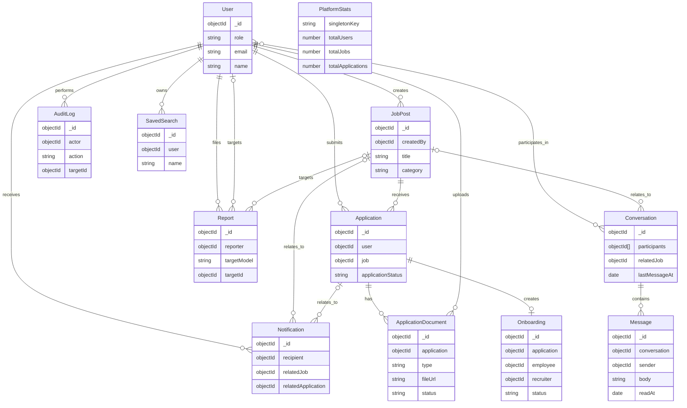

```mermaid
erDiagram
    User ||--o{ JobPost : creates
    User ||--o{ Application : submits
    JobPost ||--o{ Application : receives

    User ||--o{ Notification : receives
    JobPost o|--o{ Notification : relates_to
    Application o|--o{ Notification : relates_to

    User ||--o{ AuditLog : performs
    User ||--o{ SavedSearch : owns
    User ||--o{ Report : files
    User o|--o{ Report : targets
    JobPost o|--o{ Report : targets

    Application ||--o{ ApplicationDocument : has
    User ||--o{ ApplicationDocument : uploads
    Application ||--o| Onboarding : creates
    Conversation ||--o{ Message : contains
    User o{--o{ Conversation : participates_in
    JobPost o|--o{ Conversation : relates_to

    User {
        objectId _id
        string role
        string email
        string name
    }

    JobPost {
        objectId _id
        objectId createdBy
        string title
        string category
    }

    Application {
        objectId _id
        objectId user
        objectId job
        string applicationStatus
    }

    ApplicationDocument {
        objectId _id
        objectId application
        string type
        string fileUrl
        string status
    }

    Conversation {
        objectId _id
        objectId[] participants
        objectId relatedJob
        date lastMessageAt
    }

    Message {
        objectId _id
        objectId conversation
        objectId sender
        string body
        date readAt
    }

    Onboarding {
        objectId _id
        objectId application
        objectId employee
        objectId recruiter
        string status
    }

    Notification {
        objectId _id
        objectId recipient
        objectId relatedJob
        objectId relatedApplication
    }

    AuditLog {
        objectId _id
        objectId actor
        string action
        objectId targetId
    }

    SavedSearch {
        objectId _id
        objectId user
        string name
    }

    Report {
        objectId _id
        objectId reporter
        string targetModel
        objectId targetId
    }

    PlatformStats {
        string singletonKey
        number totalUsers
        number totalJobs
        number totalApplications
    }
```
