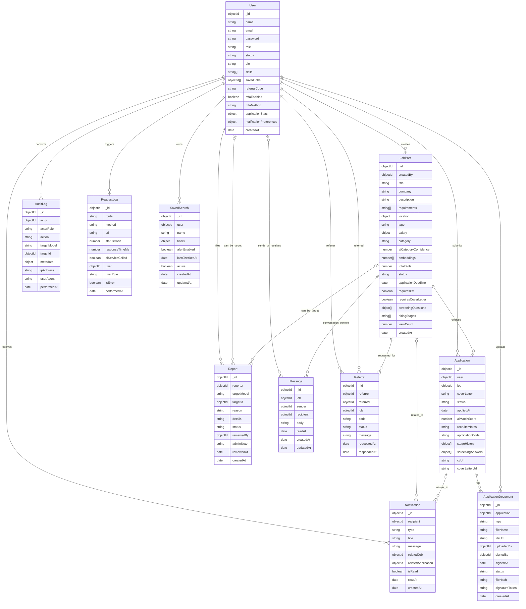

# Schema Diagram

The diagram below reflects the currently implemented runtime models. Future-only schemas under `backend/src/features/_future` are intentionally excluded.

```mermaid
erDiagram
    User ||--o{ JobPost : creates
    User ||--o{ Application : submits
    JobPost ||--o{ Application : receives

    User ||--o{ Notification : receives
    JobPost o|--o{ Notification : relates_to
    Application o|--o{ Notification : relates_to

    User ||--o{ AuditLog : performs
    User ||--o{ RequestLog : triggers
    User ||--o{ SavedSearch : owns
    User ||--o{ Report : files
    User o|--o{ Report : can_be_target
    JobPost o|--o{ Report : can_be_target

    Application ||--o{ ApplicationDocument : has
    User ||--o{ ApplicationDocument : uploads
    User o{--o{ Message : sends_or_receives
    JobPost ||--o{ Message : conversation_context

    User ||--o{ Referral : referrer
    User ||--o{ Referral : referred
    JobPost ||--o{ Referral : requested_for

    User {
        objectId _id
        string name
        string email
        string password
        string role
        string status
        string bio
        string[] skills
        objectId[] savedJobs
        string referralCode
        boolean mfaEnabled
        string mfaMethod
        object applicationStats
        object notificationPreferences
        date createdAt
    }

    JobPost {
        objectId _id
        objectId createdBy
        string title
        string company
        string description
        string[] requirements
        object location
        string type
        object salary
        string category
        number aiCategoryConfidence
        number[] embeddings
        number totalSlots
        string status
        date applicationDeadline
        boolean requiresCv
        boolean requiresCoverLetter
        object[] screeningQuestions
        string[] hiringStages
        number viewCount
        date createdAt
    }

    Application {
        objectId _id
        objectId user
        objectId job
        string coverLetter
        string status
        date appliedAt
        number aiMatchScore
        string recruiterNotes
        string applicationCode
        object[] stageHistory
        object[] screeningAnswers
        string cvUrl
        string coverLetterUrl
    }

    Notification {
        objectId _id
        objectId recipient
        string type
        string title
        string message
        objectId relatedJob
        objectId relatedApplication
        boolean isRead
        date readAt
        date createdAt
    }

    AuditLog {
        objectId _id
        objectId actor
        string actorRole
        string action
        string targetModel
        objectId targetId
        object metadata
        string ipAddress
        string userAgent
        date performedAt
    }

    RequestLog {
        objectId _id
        string route
        string method
        string url
        number statusCode
        number responseTimeMs
        boolean aiServiceCalled
        objectId user
        string userRole
        boolean isError
        date performedAt
    }

    SavedSearch {
        objectId _id
        objectId user
        string name
        object filters
        boolean alertEnabled
        date lastCheckedAt
        boolean active
        date createdAt
        date updatedAt
    }

    Report {
        objectId _id
        objectId reporter
        string targetModel
        objectId targetId
        string reason
        string details
        string status
        objectId reviewedBy
        string adminNote
        date reviewedAt
        date createdAt
    }

    ApplicationDocument {
        objectId _id
        objectId application
        string type
        string fileName
        string fileUrl
        objectId uploadedBy
        objectId signedBy
        date signedAt
        string status
        string fileHash
        string signatureToken
        date createdAt
    }

    Message {
        objectId _id
        objectId job
        objectId sender
        objectId recipient
        string body
        date readAt
        date createdAt
        date updatedAt
    }

    Referral {
        objectId _id
        objectId referrer
        objectId referred
        objectId job
        string code
        string status
        string message
        date requestedAt
        date respondedAt
    }
```
